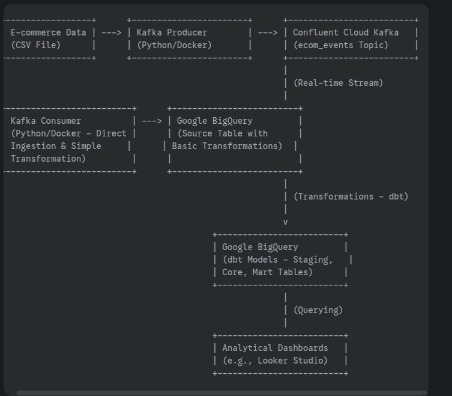

ill do it last step

### BigQuery Table Design Decisions

The BigQuery `events_source` table is designed with performance and cost-efficiency for analytical queries in mind. We've implemented the following partitioning and clustering strategy:

* **Partitioning by `event_time`:** The table is partitioned by the `event_time` column on a daily basis. This is a crucial decision as most analytical queries on e-commerce data involve filtering by specific time ranges (e.g., daily, weekly, monthly reports). Partitioning allows BigQuery to only scan the relevant partitions, significantly reducing query costs and improving performance.

* **Clustering by `event_type`, `product_id`, and `category_code`:** We've chosen to cluster the data by these three fields. This is based on the expectation that common analytical queries will involve filtering or aggregating data based on the type of event (e.g., purchases, views), specific products, or product categories. Clustering co-locates data with similar values for these columns within each partition, further enhancing query performance.

* **Kafka Partition Key (`user_id`):** While the Kafka topic is partitioned by `user_id` (which is useful for ensuring message ordering per user within Kafka), we opted not to use `user_id` as the primary partitioning or clustering key in BigQuery. This is because our anticipated analytical queries are more likely to focus on time-based analysis and aggregations across different event types, products, and categories, rather than primarily filtering by individual users. We can still efficiently query data based on `user_id` in BigQuery using standard SQL filtering.